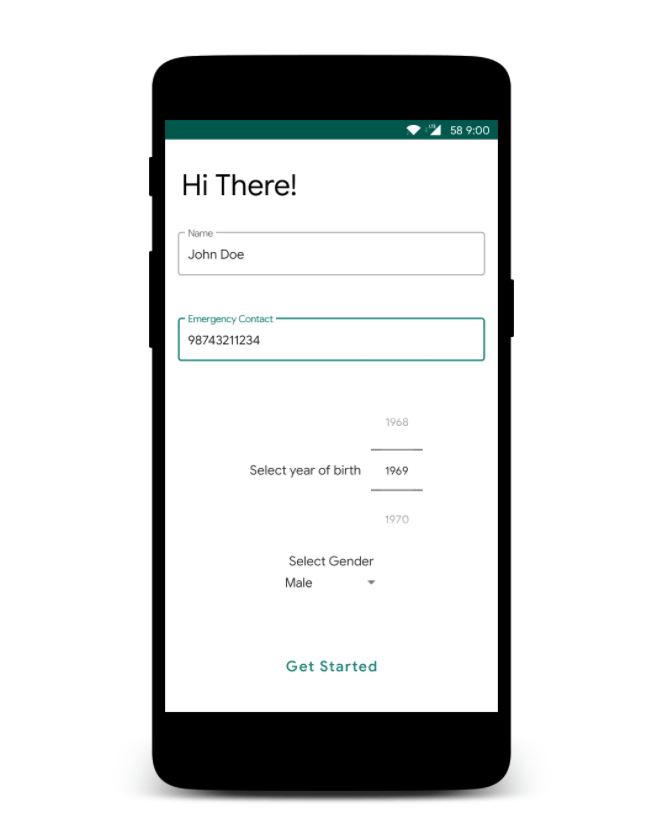

## Screenshots

  

HealthCalls is a visual prescription reminder and inventory management app.

## Features

- Set reminders with an image, up to thrice per day for multiple medications.
- Persistent Notification with name, image, and dosage.
- Inventory is updated when notification is acknowledged
- SMS will be sent to preferred contact when a medication is running low
- Emergency button, which sends current location in an SMS

## Implementation
- `AlarmManager` is used to invoke a Foreground service that generates a notification, updates inventory when the notification action button is pressed, and also sends SMS when required.
- Data is stored on `SharedPreferences`.

Some OEM's battery optimization may prevent notification delivery on time, disable battery optimization for timely updates. 